# 01 · FOC 原理入门（零基础版）

> 这篇文档的目标：让完全没接触过电机控制的人，看完能明白 FOC 到底在干什么，
> 以及本工程代码里每一步对应哪个物理概念。看不懂的地方可以先跳过，
> 结合后面的代码走读（03）回头再看，会突然通透。

---

## 1. 为什么需要 FOC？

### 1.1 无刷电机是怎么转起来的

无刷电机（BLDC/PMSM）的转子是**永磁体**，定子上有**三组线圈**（U、V、W 三相）。
给线圈通电会产生磁场，磁场吸引/推动转子上的磁铁，电机就转了。

问题在于：转子转到不同位置，需要的磁场方向也不同。
就像推旋转门——你必须**始终推在垂直于门板的方向**上，力气才全部用来让门转；
推的方向不对，一部分力气就浪费在"挤压门轴"上了。

### 1.2 三种控制方式的进化

| 方式 | 思路 | 缺点 |
| ---- | ---- | ---- |
| 方波（六步换向） | 转子每转 60° 电角度切换一次通电相 | 转矩脉动大、噪音大、低速抖 |
| 正弦（SPWM） | 给三相通正弦波电流 | 没有控制"力的方向"，效率一般 |
| **FOC（磁场定向控制）** | **实时测量转子位置，让定子磁场始终垂直于转子磁场** | 算法复杂（但我们有 MCU！） |

FOC 的本质一句话：**任何时刻都把电流精确地"推"在最能产生转矩的方向上。**
效果是：转矩平滑、噪音小、效率高、低速可控、还能精确控制力矩大小。

---

## 2. FOC 的三大数学工具

直接控制三相电流很难——它们是三个互差 120° 的交流量，一直在变。
FOC 用两次坐标变换，把"三个交流量"变成"两个直流量"，问题瞬间简单。

先看全景图，后面每一小节都是在讲这张图里的一个方块：

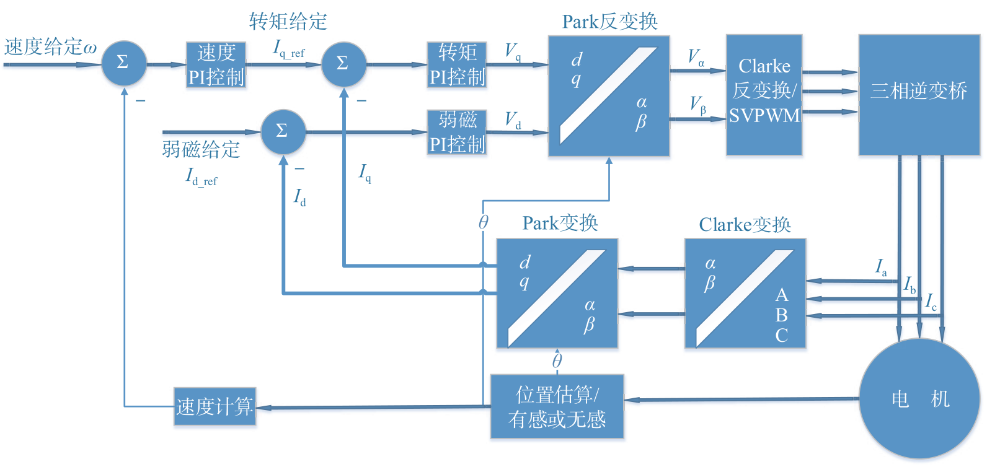

> 一句话概括：**Clarke 降维**（3 个量 → 2 个量）、**Park 转到转子视角**
> （交流量 → 直流量）→ 用 PI 控直流量 → 再反变换回去输出 PWM。

### 2.1 Clarke 变换：三相 → 两相（αβ）

三相电流 Iu、Iv、Iw 其实是冗余的（基尔霍夫定律：Iu+Iv+Iw=0，知道两个就能算第三个）。
Clarke 变换把 120° 分布的三相投影到一个直角坐标系（α 轴与 U 相重合，β 轴垂直于它）：

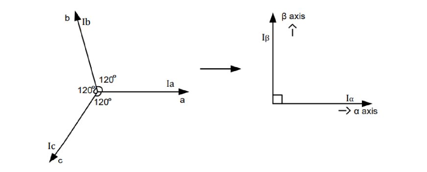

左边是把三相互差 120° 的正弦波形**抽象成三个矢量**，右边是要投影到的直角坐标系。
把三个矢量都投影到这两根轴上，"三矢量问题"就变成了"二维平面问题"：

```
α = Iu
β = (Iu + 2·Iv) / √3
```

对应代码：[foc_transform.h](../MDK-ARM/Code/foc/Core/foc_transform.h) 的 `foc_clarke()`。

变换后，三个交流量变成了两个交流量（一个旋转的电流矢量在直角坐标系里的 x、y 分量）。
**注意此时还是交流**——两个相差 90° 的正弦波，所以还需要第二步。

### 2.2 Park 变换：静止 → 旋转（dq）

关键一步来了。想象你**坐到转子上**，跟着转子一起转——
在你眼里，原本旋转的电流矢量就**静止**了！

先理解"为什么必须转到转子视角"：αβ 坐标系是**固定在定子上**的，
转子一转，对应转子状态的 Iα、Iβ 就一直在变：

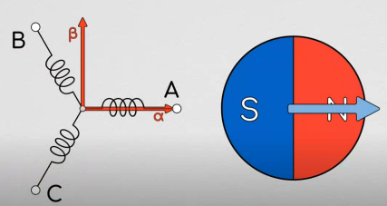

Park 的做法是在 αβ 之上再建一个**跟着转子一起转**的 dq 坐标系
（d 轴指向转子 N 极），两个坐标系之间的夹角 θ 就是**电角度**：

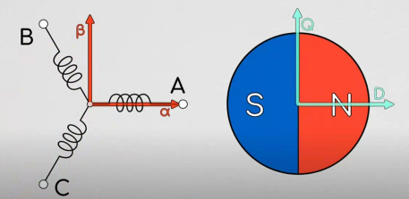

于是变换公式就是一个旋转矩阵：

```
d =  α·cosθ + β·sinθ     （d 轴：指向转子磁极方向）
q = -α·sinθ + β·cosθ     （q 轴：垂直于磁极方向）
```

对应代码：`foc_park()`。

物理意义豁然开朗（d 是"径向"、q 是"切向"）：
- **Id（d 轴电流）**：沿着磁极方向的电流 → 只会加强/削弱磁场，**不产生转矩**，通常控制为 0；
- **Iq（q 轴电流）**：垂直于磁极的电流 → **全部用来产生转矩**，转矩 ∝ Iq。

于是"控制转矩"这个难题，变成了"把 Id 控到 0、把 Iq 控到目标值"两个简单的直流量控制问题——PI 控制器的舒适区。

> **两步变换的本质**（一句话记住）：
> **Clarke** 把三个相差 120° 的正弦波变成两个相差 90° 的正弦波（降维）；
> **Park** 把这两个正弦波变成两个**直流量**（旋转到转子视角）。
> 交流量难跟踪，直流量一个 PI 就搞定——这就是全部动机。

### 2.3 SVPWM：怎么把算出来的电压加到电机上

PI 控制器算出"我想在 dq 方向上施加电压 (Vd, Vq)"之后：
1. **反 Park** 变换转回静止坐标系 (Vα, Vβ)；
2. **SVPWM** 把这个电压矢量翻译成三个半桥的开关占空比。

#### 2.3.1 先理解"矢量"从哪来：8 种开关状态

三相半桥各有"上管通/下管通"两种状态，记为 1/0，一共 2³ = **8 种组合**：

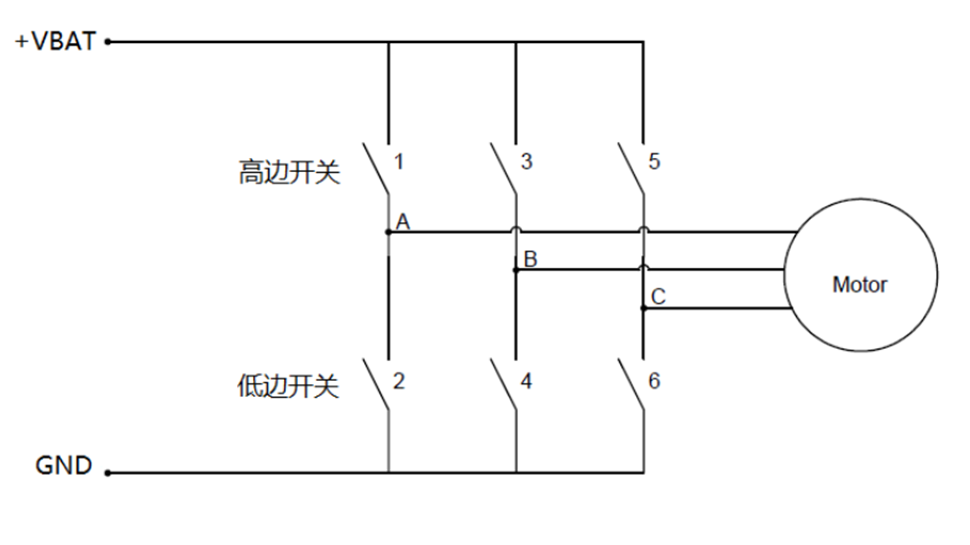

- **6 个基础矢量**（100、110、010、011、001、101）：每个在空间中指向一个固定方向，
  相邻两个相差 60°；
- **2 个零矢量**（000 全接地、111 全接电源）：电机三相电位相同、不产生磁场，
  相当于"空挡"——**它们是低边电流采样的黄金窗口**（见 §4.2）。

6 个基础矢量的顶点连起来是一个正六边形，圆心到顶点就是该方向能输出的最大电压：

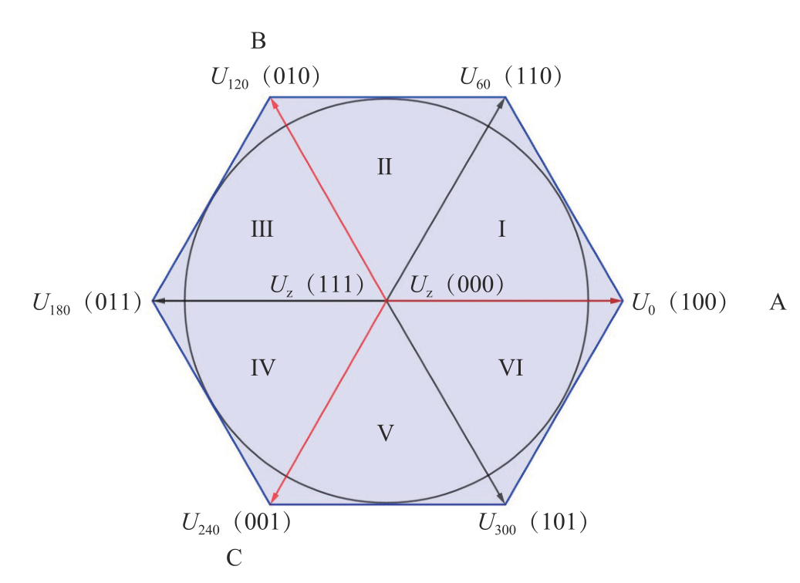

> **为什么最大只能到内切圆？** 要输出**平滑旋转**的电压矢量，
> 各个方向的能力必须一致，所以只能用六边形的**内切圆**，
> 半径 = Udc/√3 ≈ 0.577·Udc——这正是本工程电压限幅用的值。

#### 2.3.2 任意方向怎么合成：伏秒平衡

任意一个目标电压矢量 Uref，都可以用**相邻的两个基础矢量 + 零矢量**
按时间比例"拼"出来（伏秒平衡原理）：

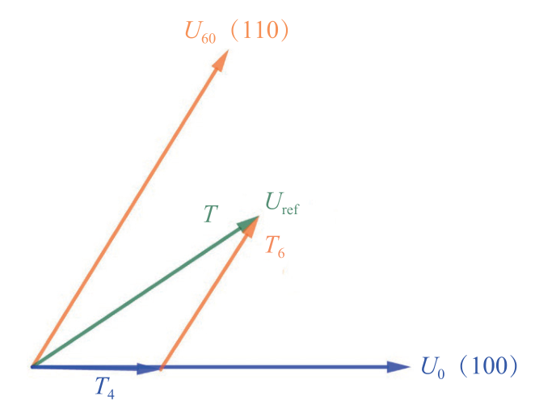

```
Uref · T = Ux · Tx + Uy · Ty + Uz · Tz
```

即：一个周期内，先让 Ux 作用 Tx 时间，再让 Uy 作用 Ty 时间，剩下时间给零矢量，
平均效果就等于 Uref。这就是"空间矢量调制"的全部思想。

#### 2.3.3 本工程的实现：中点注入法（等价但更省算力）

教科书做法要先判断扇区、再查表算 Tx/Ty。本工程（与 VESC、SimpleFOC 相同）
用**数学上完全等价**、但代码只有几行的**中点注入法**：

```
先反 Clarke 得到三相目标电压 va, vb, vc
v_common = -(max + min) / 2          ← 注入零序（共模）分量
duty_x   = 0.5 + (v_x + v_common)/Udc
```

注入的共模分量对**线电压没有任何影响**（三相同时抬高/降低，电机感受不到），
却能把调制波从正弦变成"马鞍波"，从而把母线电压利用率提高 15.5%：

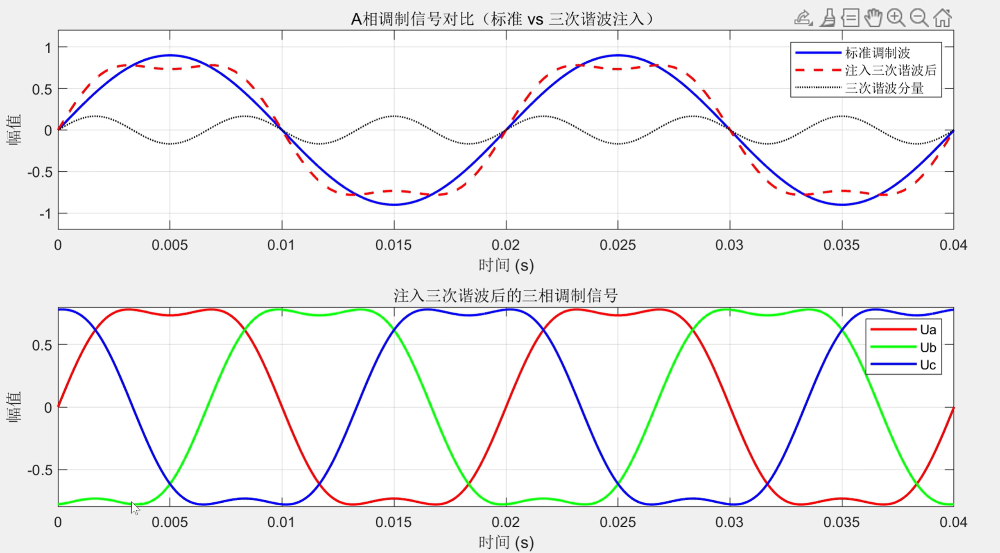

对应代码：[foc_svm.c](../MDK-ARM/Code/foc/Core/foc_svm.c)。

#### 2.3.4 扇区号还是要算（给电流采样用）

虽然中点注入不需要扇区就能算占空比，但**低边电流采样需要知道扇区**
（决定采哪两相，见 §4.2）。本工程用的是免三角函数的快速判别法：

```c
A = (Uβ > 0)                    ← 三次比较代替 arctan
B = (√3·Uα - Uβ > 0)
C = (-√3·Uα - Uβ > 0)
N = A + 2B + 4C                 ← 拼成 3 位二进制，查表得扇区
```

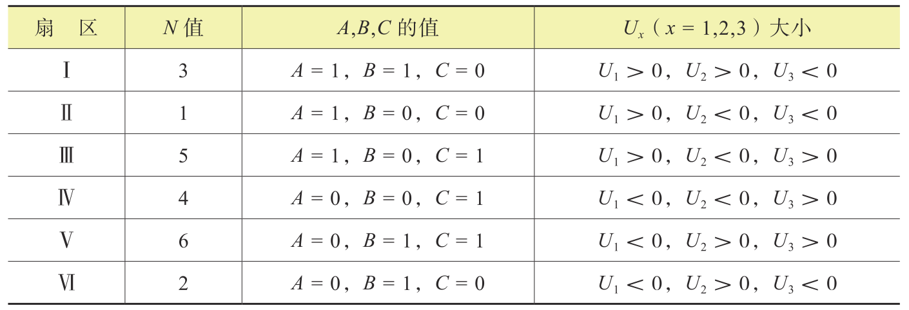

> 为什么不直接 `arctan(Uβ/Uα)`？单片机上反三角函数太贵，
> 而三次减法+比较只要几个时钟周期。这是嵌入式 FOC 的经典技巧。

> **为什么占空比以 0.5 为中心？**
> 本工程 PWM 是"中心对齐"模式，占空比 0.5 表示上下管各开一半时间，
> 相当于该相输出 Udc/2 的平均电压。三相都是 0.5 时相间电压为 0，电机不动。

---

## 3. 完整的 FOC 控制环

把上面的工具串起来，就是每个 PWM 周期（本工程 16 kHz，即 62.5 µs）执行一次的**快环**：

```
        ┌────────────────────────────────────────────────────────────┐
        │                     一个 62.5µs 周期内                      │
        │                                                            │
 ADC采样 → Iu,Iv,Iw → Clarke → Iα,Iβ → Park(θ) → Id,Iq              │
        │                                        ↓        ↓          │
        │                            Id_ref=0 →(PI)  Iq_ref →(PI)    │
        │                                        ↓        ↓          │
        │                                       Vd       Vq          │
        │                                        └───┬────┘          │
 编码器 → θ机械 × 极对数 + 偏移 = θ电角度 ──────────→ 反Park(θ)       │
        │                                            ↓               │
        │                                         Vα,Vβ              │
        │                                            ↓               │
        │                                         SVPWM              │
        │                                            ↓               │
        │                                    三相占空比 → 定时器      │
        └────────────────────────────────────────────────────────────┘
```

对应代码：[foc_motor.c](../MDK-ARM/Code/foc/Core/foc_motor.c) 的 `foc_motor_fast_loop()`，
建议对照上图逐行阅读，每一步都有注释。

### 3.1 级联：速度环和位置环

电流环只管"力"。要控制"转速"和"位置"，在外面再套环（**级联控制**）：

```
位置模式:  目标位置 →[位置P]→ 目标速度 →[速度PI]→ 目标Iq →[电流环]→ 电压
速度模式:              目标速度 →[速度PI]→ 目标Iq →[电流环]→ 电压
力矩模式:                          目标Iq →[电流环]→ 电压
```

为什么外环可以比内环慢？因为**机械时间常数远大于电气时间常数**——
转速不可能在几十微秒内突变。所以本工程：
- 电流环：16 kHz（每个 PWM 周期）
- 速度/位置环：1 kHz（快环 16 分频，`foc_motor_slow_loop()`）

这也是 ODrive/VESC 的调度方式。

### 3.2 PI 参数怎么定？（电流环自动整定）

电机的电气模型是一阶惯性环节：`G(s) = 1/(Ls + R)`。
按 ODrive 的带宽整定法，给定期望闭环带宽 ω（rad/s）：

```
Kp = L × ω        Ki = R × ω
```

这样 PI 的零点恰好对消电机的极点，闭环变成干净的一阶环节，理论上不会超调。
本工程默认 ω = 1000 rad/s（约 160 Hz），在 `foc_motor_init()` 里自动算好。
你只需要填对电机的 R 和 L（[foc_config.h](../MDK-ARM/Code/foc/HAL/foc_config.h)）。

---

## 4. 两个工程实践问题

### 4.1 转子角度从哪来？——编码器 + 上电校准

FOC 需要**电角度**（θe = 机械角 × 极对数 + 偏移）。本工程用 ABZ 增量编码器：
- A/B 相：正交脉冲，定时器硬件自动计数（TIM4 编码器模式）；
- Z 相：每圈一个脉冲，用于消除累积误差。

#### 为什么必须校准：三个"零点"对不齐

FOC 里有三个各自独立的零点，它们的关系决定了能不能正确定向：

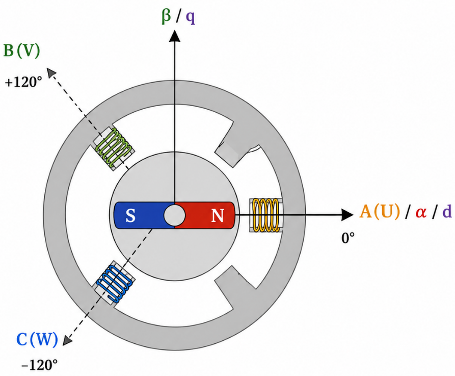

| 坐标/轴 | 零点在哪 | 固定于 |
| ---- | ---- | ---- |
| α 轴 / A(U) 相轴线 | 定子 U 相绕组的方向 | 定子（不动） |
| d 轴 | 转子 N 极方向 | 转子（跟着转） |
| 编码器零点 | 编码器自己的 0 计数位置 | 安装时随机确定 |

**电气零点**的定义：d 轴（转子 N 极）与 α 轴（U 相轴线）重合时，θe = 0°。

问题在于：编码器是人工装上去的，它的 0° 几乎不可能正好落在电气零点上，
两者之间必然存在一个**安装偏差 θ_offset**：

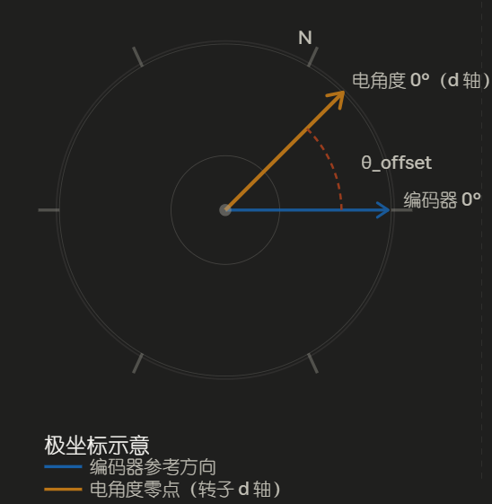

好消息是：只要编码器不拆，这个偏差就是**固定不变**的常数。
测出来一次，之后就能用一个减法补偿掉：

```
真实电角度 = 编码器算出的电角度 − θ_offset
即本工程的：θe = direction × 极对数 × θ机械 + offset
```

#### 怎么测：D 轴强拉法

核心一句话：**把转子强行拉到电气零点，此时编码器的读数就是偏移量。**

原理是给 d 轴通直流（Vd > 0、Vq = 0），定子产生一个**方向固定不变**的磁场，
转子像指南针一样被"吸"到 d 轴 = 0° 的位置（这个过程电机不会转圈）。

本工程 [foc_calib.c](../MDK-ARM/Code/foc/App/foc_calib.c) 的完整流程：

| 步骤 | 操作 | 为什么 |
| :--: | ---- | ---- |
| 1 | **自举充电**（10ms） | 给高边驱动的自举电容充电，否则上管开不起来 |
| 2 | **中点 PWM 观察**（2s） | 确认功率级正常、电流为零，出问题在这一步就跳闸 |
| 3 | **D 轴对齐**（0.8s，电压缓升） | 转子被吸到已知电角度，等振荡衰减 |
| 4 | **强行清零** | 转子锁死不动时，把编码器计数清零作为临时零点 |
| 5 | **慢转找 Z**（20 RPM，超时 10s） | 撤销对齐电压，开环慢转直到 Z 脉冲到来 |
| 6 | **算出 offset** | Z 到来瞬间的计数换算成电角度即为偏移，之后 θm 从 Z 起算 |

> **为什么要找 Z？** 步骤 4 的清零点是"这一次上电时转子恰好停的位置"，
> 断电就没了。而 Z 脉冲是编码器**物理上固定**的标记，
> 把偏移量记录成"相对于 Z"的值，下次上电只要再找到 Z 就能复用——
> 这正是本工程 Flash 存储 + 快速索引搜索的原理（见 [06 篇](06_稳定性与保护.md) §6）。

> **调试提醒**：对齐电流建议取额定电流的 10%~30%（太小吸不住，太大发热）；
> 慢转找 Z 的速度 30~60 RPM 比较稳妥。本工程默认值已按小电机调过，
> 换大电机时见 [08 篇](08_调参与调试手册.md) §2。

> 想直观看懂三个坐标系的关系？用浏览器打开
> [img/foc_visualizer.html](img/foc_visualizer.html)（交互式动画，拖动即可）。

### 4.2 电流怎么测？——低边采样 + 采样窗口

#### 三种采样位置

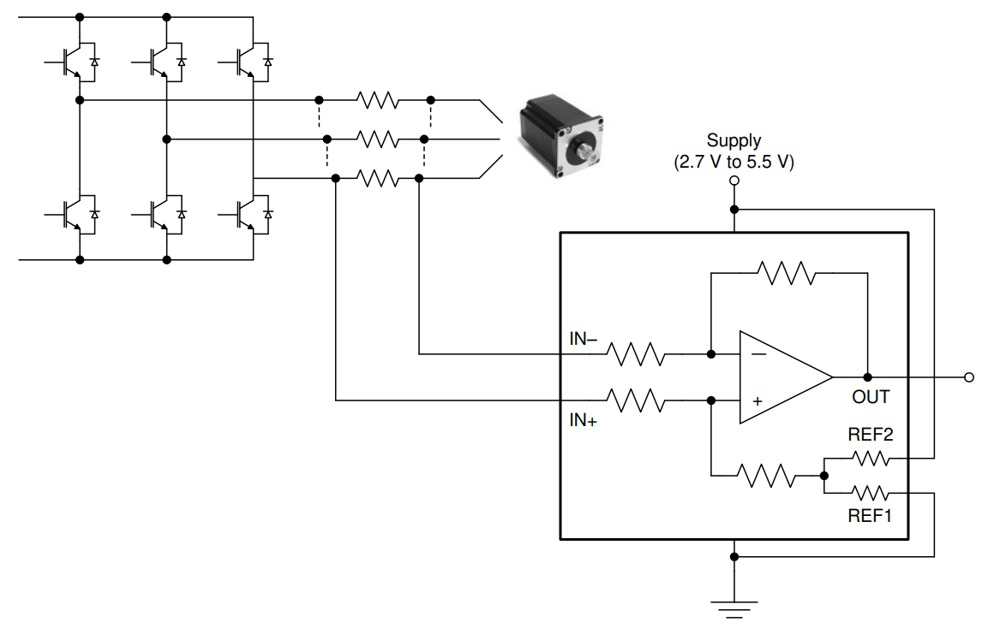
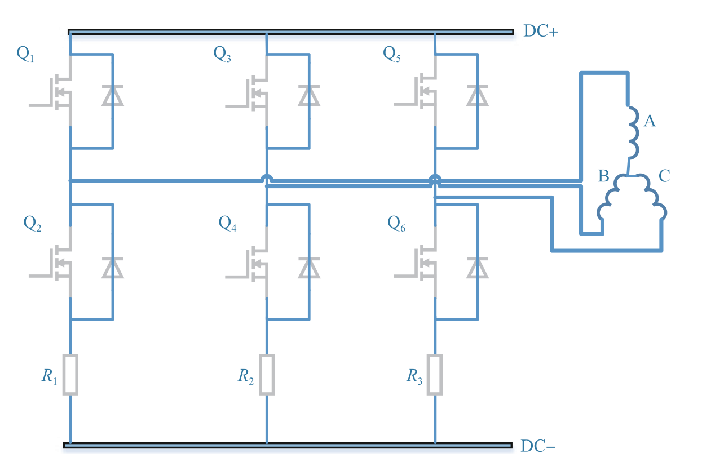

| 方案 | 电阻位置 | 优点 | 缺点 |
| ---- | ---- | ---- | ---- |
| **高边采样** | 上管与电机相线之间 | 任何 PWM 状态都能测；能检出对地短路 | 需要专用高共模运放（INA240 等），贵 |
| **低边采样** | 下管与 GND 之间 | 普通运放即可，成本极低 | **只能在下管导通期间采样**，高占空比时窗口变窄 |

本工程用的是**三电阻低边采样**（三个半桥各串一个采样电阻）：

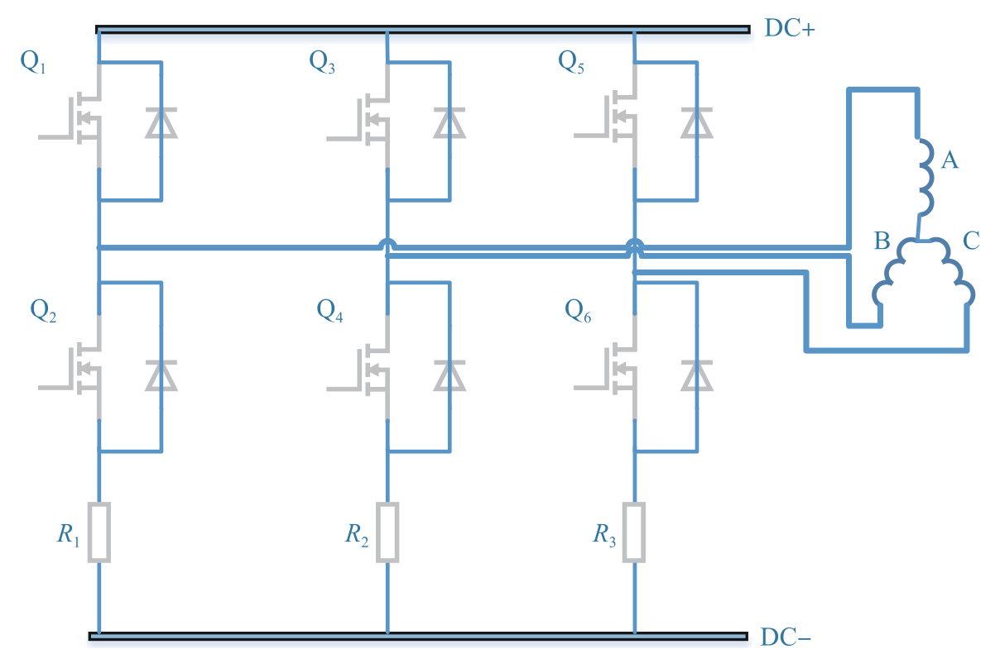

> 单电阻（母线）采样最省钱但算法最复杂；双电阻是折中；
> 三电阻在成本和实现难度上最平衡，是绝大多数 ESC 的选择。
> 移植到其它拓扑的说明见 [07 篇](07_移植指南.md) §5。

#### 关键：什么时候采？

低边采样有个绕不开的物理限制：**只有下管导通时，采样电阻上才有电流**。

好在电机绕组有电感、电流不能突变——当三相下管**全部导通**（零矢量 V0(000)）时，
绕组电流仍会经下管和采样电阻**续流**，此时测得的正是真实的相电流。
所以采样点要对准零矢量窗口的中心，而且必须避开开关沿的振铃：

```
t_窗口 > t_死区 + t_建立(振铃衰减+运放) + t_ADC采样 + t_裕量
```

本工程的硬件同步做法（继承自 ST MCSDK，已在本板验证）：
- PWM 用**中心对齐**模式，零矢量自然分布在周期两端；
- TIM1 的 **CH4 空闲通道**产生比较事件 → TRGO → 硬件触发 ADC 注入组，
  **全程不靠软件中断发起采样**，时序确定；
- CCR4 设在 `ARR - n`（提前 n 个计数），补偿 ADC 触发到采样保持的延迟。

#### 盲区与扇区选相

某一相占空比很高时，它的**下管导通时间极短**，短到装不下上面那个不等式，
这一相的采样结果就不可信——这叫**采样盲区**：

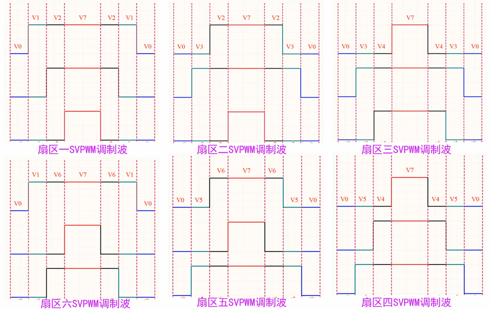

解决办法：**永远跳过占空比最高的那一相**，采另外两相，
第三相用基尔霍夫定律 Iu+Iv+Iw=0 重构。而"哪一相占空比最高"由当前 SVPWM 扇区决定：

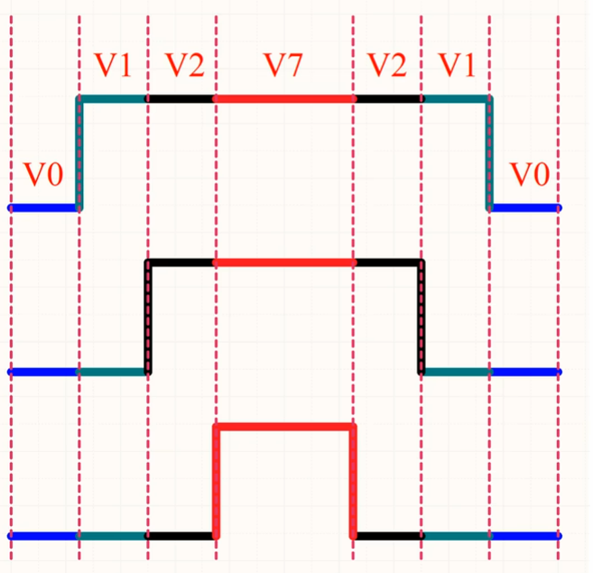

| SVPWM 扇区 | 占空比最高相 | ADC1 采 | ADC2 采 | 软件重构 |
| :--: | :--: | :--: | :--: | :--: |
| 1、6 | U | W | V | Iu = −(Iv + Iw) |
| 2、3 | V | U | W | Iv = −(Iu + Iw) |
| 4、5 | W | U | V | Iw = −(Iu + Iv) |

> **一个隐蔽的坑**：定时器开了 CCR 预装载后，中断里刚算出的占空比
> 要到**下一个**更新事件才生效。所以选相必须用"当前正在输出的 CCR"
> 对应的扇区，不能用刚算出来的下一周期扇区——本工程
> [current_shunt.c](../MDK-ARM/Code/foc/Driver/current/current_shunt.c)
> 的 `current_shunt_prepare_pwm()` 正是为此存在。

---

## 5. 本工程从三大开源项目学了什么

| 项目 | 借鉴的精华 | 落在哪 |
| ---- | ---- | ---- |
| **SimpleFOC** | PID/LPF 的简洁实现（Tustin 积分+抗饱和+输出斜坡）；传感器/驱动/电流采样三大抽象接口；级联控制模式切换 | `foc_pid.c`、`foc_types.h` 接口表、`foc_motor.c` |
| **ODrive** | 轴对象化（一轴一对象，天然多电机）；电流环带宽自动整定 Kp=Lω Ki=Rω；状态机化的上电校准流程；Rs/Ls 参数自动测量；梯形轨迹规划 | `foc_motor_t`、`foc_motor_init()`、`foc_calib.c`、`foc_ident.c`、`foc_traj.c` |
| **VESC** | 中点注入 SVPWM 写法；全部控制放中断里的确定性调度；故障码集中管理 + 终端命令行调试；磁链观测器（预留） | `foc_svm.c`、`foc_motor_fast_loop()`、`foc_cmd.c`、`foc_observer.c` |
| **ST MCSDK** | 三电阻低边采样的窗口规划、自举电容预充电、ADC 注入队列时序（这部分在本板硬件上验证过） | `current_shunt.c`、`foc_board_g431.c` |
| **MESC / moteus** | 调研对象：MESC 的 HFI 低速无感、moteus 的高级位置控制与热模型是后续路线图（见 05 篇） | 暂未落地，思路记录在文档 |

---

## 6. 常见疑问（FAQ）

**Q：电角度和机械角是什么关系？**
A：θe = 极对数 × θm。极对数 = 转子上磁铁的 N-S 对数。7 对极的电机机械转一圈，
电流要"转" 7 圈。所以电角度是"电流坐标系"里的角度。

**Q：为什么 Id 要控成 0？**
A：表贴式永磁电机（绝大多数无人机/云台电机）的磁阻转矩为 0，Id 不产生转矩，
只产生热和磁场变化。Id=0 就是"所有电流都用来干活"。（高速弱磁是另一个话题。）

**Q：开环 V/f 模式是什么，为什么保留它？**
A：不看任何反馈，软件自己转一个虚拟角度并施加固定电压——"盲转"。
它是排查硬件问题的最强工具：能开环转说明功率级、相序、PWM 都对；
再上编码器、再上电流环，逐层验证（见 04 上手指南的调试顺序）。

**Q：死区是什么？**
A：同一半桥的上下管绝不能同时导通（等于电源短路）。切换时留一小段"都关"的时间
就是死区。本工程 TIM1 配置 DeadTime=63，时钟分频 CKD=DIV2 下
死区步长为 2/170MHz≈11.8ns，实际死区 63×11.8ns≈740ns。

---

下一篇：[02 · 工程架构](02_工程架构.md) —— 讲清楚代码为什么这样分层，双电机是怎么支持的。
